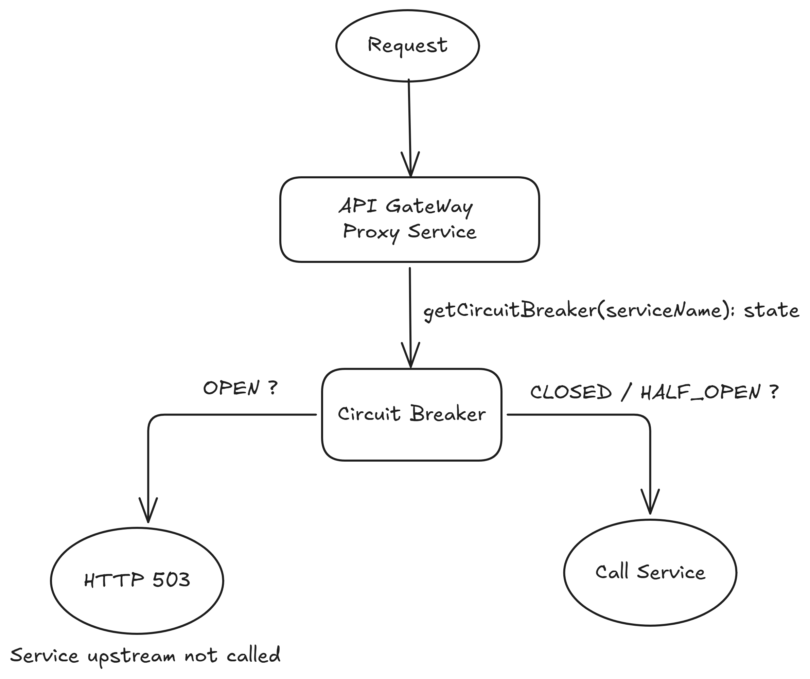

# production-grade-api-gateway
You can find the complete architectural discussion and production lessons behind this implementation in my Production Insight:
[We Thought Our API Gateway Would Protect Us. It Became Our Biggest Single Point of Failure](https://eidox.hashnode.dev/we-thought-our-api-gateway-would-protect-us-it-became-our-biggest-single-point-of-failure)

## What a Production-Grade API Gateway Actually Looks Like


## How circuit breaker works?



## Workflow

Here's how this project is wired up.

We have **3 backend services** — user, order, and payment. Each one exposes two endpoints: a `GET` and a `POST`.

- **user-service** → `GET /users` and `POST /users`
- **order-service** → `GET /orders` and `POST /orders`
- **payment-service** → `GET /payments` and `POST /payments`

On top of that we run **3 api-gateway instances** (`api-gateway-1`, `api-gateway-2`, `api-gateway-3`). They all do the same job — verify the JWT, attach user headers, and forward the request to the right service.

**Nginx** sits in front as the entry point on port 80. It handles a few things before traffic even hits the gateway:

- **Load balancing** across all 3 api-gateway instances using `least_conn` (sends the next request to whichever instance has the fewest active connections)
- **Rate limiting** at 10 requests per second per IP (with a burst of 20)
- **Real client IP forwarding** via `X-Forwarded-For` and `X-Real-IP`, so the gateway knows who actually made the request

The full path looks like this:

```
Client : Nginx : api-gateway (1 of 3) : backend service
```

If a service starts failing too much, the **circuit breaker** on the gateway stops calling it and returns a `503` instead of waiting for a timeout. Once the cooldown passes, it lets a few test requests through to see if things are back up.
